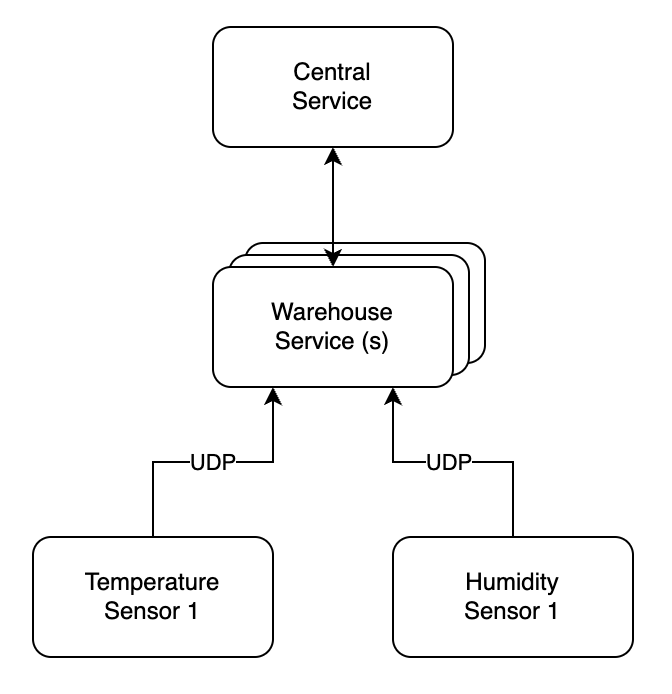

# Warehouse Monitoring System

A reactive system where a Warehouse Service collects UDP sensor data (temperature/humidity) and forwards it to a Central Monitoring Service. The central service triggers console alarms if measurements exceed predefined thresholds.

## Description:

There is a warehouse equipped with various types of sensors that monitor environmental
conditions. These sensors provide measurements such as current temperature and
humidity, which are transmitted via UDP. The warehouse service interacts with all these
sensors and automatically publishes the measurements to a central monitoring service. This
service oversees multiple warehouses and activates an alarm if temperature or humidity
readings exceed configured thresholds.





System Design:
Your task is to design a reactive system that includes:
• Warehouse Service: Collects data from various sensors and sends it to the Central  Monitoring Service.
• Central Monitoring Service: Configured with thresholds for temperature and  humidity. Raises an alarm when sensor measurements cross these thresholds. The alarm message should be visible in the logs/console.

Specifications:
• Sensor Types: Temperature, Humidity
• Communication: Measurements are sent via UDP.
• Central Service Features: Threshold monitoring, alarm activation.

Technical Requirements:
• Temperature Sensor:
    o UDP Port: 3344
    o Measurement Syntax: sensor_id=t1; value=30
    o Threshold: 35°C
• Humidity Sensor:
    o UDP Port: 3355
    o Measurement Syntax: sensor_id=h1; value=40
    o Threshold: 50%

Development Expectations:
• No user interactions are required.
• A simple command line/console output is sufficient; no GUI is needed.
• Consider adding test coverage, if possible.
• Sensors can be simulated using any utility capable of sending UDP messages, such as  netcat.
• Usage of message broker is added advantage.

---

## Implementation Details

### Architecture

The system is built using **Spring Boot 4.0.2** with **Project Reactor** for reactive programming:

1. **Warehouse Service** (`WarehouseService.java`)
   - Uses Reactor Netty to listen on UDP ports 3344 (temperature) and 3355 (humidity)
   - Parses incoming sensor messages using `SensorMessageParser`
   - Publishes measurements to the internal event bus

2. **Central Monitoring Service** (`CentralMonitoringService.java`)
   - Subscribes to the reactive event bus
   - Compares measurements against configured thresholds
   - Triggers console alarms with severity levels (WARNING, HIGH, CRITICAL)

3. **Event Bus** (`MeasurementEventBus.java`)
   - Uses Project Reactor's `Sinks.Many` for fully reactive pub/sub communication
   - Decouples the Warehouse Service from the Monitoring Service

### Configuration

Configuration is managed via `application.properties`:

```properties
# Sensor ports
sensor.temperature-port=3344
sensor.humidity-port=3355

# Thresholds
monitoring.temperature-threshold=35.0
monitoring.humidity-threshold=50.0
```

---

## Running the Application

### Build and Run

```bash
# Build the project
./mvnw clean package

# Run the application
./mvnw spring-boot:run
```

### Testing with netcat

Once the application is running, you can simulate sensors using netcat:

**Send temperature sensor data (normal - no alarm):**
```bash
echo "sensor_id=t1; value=30" | nc -u localhost 3344
```

**Send temperature sensor data (exceeds threshold - triggers alarm):**
```bash
echo "sensor_id=t1; value=40" | nc -u localhost 3344
```

**Send humidity sensor data (normal - no alarm):**
```bash
echo "sensor_id=h1; value=45" | nc -u localhost 3355
```

**Send humidity sensor data (exceeds threshold - triggers alarm):**
```bash
echo "sensor_id=h1; value=60" | nc -u localhost 3355
```

### Running Tests

```bash
./mvnw test
```

---

## Project Structure

```
src/main/java/mk/dmt/wms/
├── Application.java              # Main Spring Boot application
├── config/
│   ├── MonitoringConfig.java     # Threshold configuration
│   └── SensorConfig.java         # UDP port configuration
├── controller/
│   └── MonitoringController.java # REST API for web dashboard (SSE)
├── event/
│   ├── AlarmEvent.java           # Alarm event record
│   └── MeasurementEventBus.java  # Reactive event bus
├── model/
│   ├── SensorMeasurement.java    # Measurement data record
│   └── SensorType.java           # Sensor type enum
├── monitoring/
│   └── CentralMonitoringService.java  # Threshold monitoring & alarms
└── sensor/
    ├── SensorMessageParser.java  # UDP message parser
    └── WarehouseService.java     # UDP listener service
```

---

## Web Dashboard

### Accessing the Dashboard

Once the application is running, open your browser to:

```
http://localhost:8080/
```

You'll see a real-time monitoring dashboard with:
- 🌡️ **Temperature sensors** - Live readings
- 💧 **Humidity sensors** - Live readings  
- 🚨 **Active alarms** - Color-coded by severity (WARNING/HIGH/CRITICAL)
- 🟢 **Connection status** - Shows if connected to server

### How It Works

The dashboard uses **Server-Sent Events (SSE)** to receive real-time updates:

1. Browser opens SSE connection to `/api/monitoring/measurements`
2. Server streams sensor data as it arrives via UDP
3. Dashboard automatically updates without page refresh
4. Alarms appear instantly when thresholds are exceeded

### Testing the Dashboard

Use the automated test script:

```bash
./test-dashboard.sh
```

Or manually:

```bash
# Terminal 1: Start the app
./mvnw spring-boot:run

# Terminal 2: Send test data
echo "sensor_id=zone_a; value=25.0" | nc -u localhost 3344  # Normal
echo "sensor_id=zone_b; value=42.0" | nc -u localhost 3344  # Alarm!
echo "sensor_id=zone_c; value=75.0" | nc -u localhost 3355  # Alarm!
```

Watch the dashboard update in real-time!

### API Endpoints

```bash
# Stream all measurements (SSE)
curl -N http://localhost:8080/api/monitoring/measurements

# Stream only alarms (SSE)
curl -N http://localhost:8080/api/monitoring/alarms
```

For more details, see: [WEB_DASHBOARD_GUIDE.md](WEB_DASHBOARD_GUIDE.md)

---

